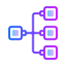

[![Contributors][contributors-shield]][contributors-url]
[![Forks][forks-shield]][forks-url]
[![Stargazers][stars-shield]][stars-url]
[![Issues][issues-shield]][issues-url]
[![License][license-shield]][license-url]

<!-- PROJECT LOGO -->
 

  

<h3 align="center">ProtoPype</h3>

  

    ProtoPype is a user friendly app that allows prototyping image processing pipelines
     
    <a href="https://github.com/tmonreal/ProtoPype"><strong>Explore the docs »</strong></a>
     
     
    <a href="https://github.com/tmonreal/ProtoPype">View Demo</a>
    ·
    <a href="https://github.com/tmonreal/ProtoPype/issues">Report Bug</a>
    ·
    <a href="https://github.com/tmonreal/ProtoPype/issues">Request Feature</a>
  

<!-- TABLE OF CONTENTS -->

  
Table of Contents

  <ol>
    <li>
      <a href="#about-the-project">About The Project</a>
      <ul>
        <li><a href="#built-with">Built With</a></li>
      </ul>
    <li><a href="#contributing">Contributing</a></li>
    <li><a href="#license">License</a></li>
    <li><a href="#contact">Contact</a></li>
    <li><a href="#acknowledgments">Acknowledgments</a></li>
  </ol>

<!-- ABOUT THE PROJECT -->
## About The Project

[![Product Name Screen Shot][product-screenshot]](https://github.com/tmonreal/ProtoPype/blob/main/icons/ProtoPype.png)

ProtoPype was designed as a visual programming tool that allows the generation of complex filtering by combining simple functional blocks in a cascade fashion. The obtained diagram guarantees a clear visualization of the flow of information through the generated channels (pipelines), as well as a quick parameterization of its constituent functions. The diagrams made can be saved to reuse both externally (in Python code) and internally (in ProtoPype libraries).

(<a href="#top">back to top</a>)

### Built With

* [Python](https://www.python.org/)
* [Kivy](https://kivy.org/#home)

(<a href="#top">back to top</a>)

<!-- CONTRIBUTING -->
## Contributing

Contributions are what make the open source community such an amazing place to learn, inspire, and create. Any contributions you make are **greatly appreciated**.

If you have a suggestion that would make this better, please fork the repo and create a pull request. You can also simply open an issue with the tag "enhancement".
Don't forget to give the project a star! Thanks again!

1. Fork the Project
2. Create your Feature Branch (`git checkout -b feature/AmazingFeature`)
3. Commit your Changes (`git commit -m 'Add some AmazingFeature'`)
4. Push to the Branch (`git push origin feature/AmazingFeature`)
5. Open a Pull Request

(<a href="#top">back to top</a>)

<!-- LICENSE -->
## License

Distributed under the MIT License. See `LICENSE.txt` for more information.

(<a href="#top">back to top</a>)

<!-- CONTACT -->
## Contact

Trinidad Monreal - trinidadmonreal@gmail.com

Juliana Ullua - julianaullua097@gmail.com

Project Link: [https://github.com/tmonreal/ProtoPype](https://github.com/github_username/repo_name)

(<a href="#top">back to top</a>)

<!-- ACKNOWLEDGMENTS -->
## Acknowledgments

This project is developed within the framework of the Faculty of Engineering, Exact and Natural Sciences (FICEN) of Favaloro University.
Special thanks to our project director Manuel Alfonso.

(<a href="#top">back to top</a>)

<!-- MARKDOWN LINKS & IMAGES -->
<!-- https://www.markdownguide.org/basic-syntax/#reference-style-links -->
[contributors-shield]: https://img.shields.io/github/contributors/tmonreal/ProtoPype.svg?style=for-the-badge
[contributors-url]: https://github.com/tmonreal/ProtoPype/graphs/contributors
[forks-shield]: https://img.shields.io/github/forks/tmonreal/ProtoPype.svg?style=for-the-badge
[forks-url]: https://github.com/tmonreal/ProtoPype/network/members
[stars-shield]: https://img.shields.io/github/stars/tmonreal/ProtoPype.svg?style=for-the-badge
[stars-url]: https://github.com/tmonreal/ProtoPype/stargazers
[issues-shield]: https://img.shields.io/github/issues/tmonreal/ProtoPype.svg?style=for-the-badge
[issues-url]: https://github.com/tmonreal/ProtoPype/issues
[license-shield]: https://img.shields.io/github/license/tmonreal/ProtoPype.svg?style=for-the-badge
[license-url]: https://github.com/tmonreal/ProtoPype/blob/main/LICENSE.txt
[product-screenshot]: https://github.com/tmonreal/ProtoPype/blob/main/icons/ProtoPype.png
